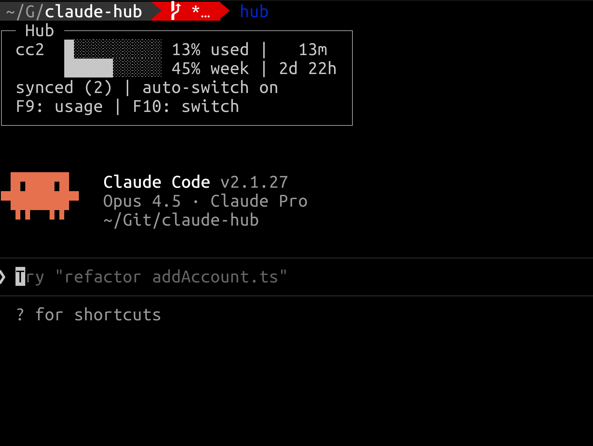
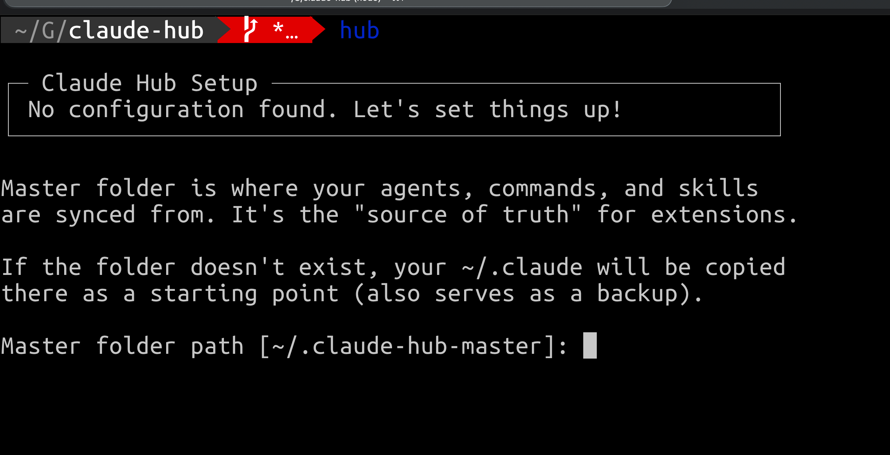

# Claude Hub

A CLI tool for managing multiple Claude Code accounts. Keeps conversations, agents, commands, and skills in sync across accounts, with real-time usage tracking to help you spread usage evenly by always starting sessions on the account with the most remaining quota. No need to logout/login to work with multiple accounts. Syncs your conversations across your accounts and sync your skills, commands, and agents through a "master" folder so you simply add a new skill/command/agent in your master folder and they will be synced to all accounts.

> **Note: macOS only** - This tool currently only works on macOS because it uses the macOS Keychain to fetch OAuth tokens for usage tracking.

### Launch Claude (Auto-Select Best Account)

```bash
hub
```



This will:
1. Check usage across all accounts
2. Auto-select the account with most remaining quota
3. Sync conversations, skills, commands, and agents, sk (if `syncOnStart` is true)
4. Launch Claude with the selected account

Example output (compact):
```
┌─ Hub ───────────────────────────────┐
│ account2  ██░░░░░░░░  22% used | ⏱ 3h 51m │
│           ███░░░░░░░  30% week | ⏱ 3d 18h │
│ ✓ synced                                  │
└───────────────────────────────────────────┘
```

Use `-v` for verbose output:
```bash
hub -v
# Shows detailed sync info and traditional launch messages
```

### Use a Specific Account

```bash
hub --account account2
```

## Why?

If you have multiple Claude Pro subscriptions, you've probably experienced this:

```
c1           # Launch first account
/usage       # Check usage... 80% used
c2           # Try second account
/usage       # 95% used, ugh
c3           # Third account?
/usage       # Session limit reached!
# Back to c1...
```

Claude Hub solves this by:
- **Auto-selecting** the best account based on remaining quota when you start a session
- **Manual switching** mid-session with F10 if you hit a rate limit
- **Syncing conversations** so you can resume from any account
- **Syncing extensions** (agents/commands/skills) from a master folder
- Showing **real usage** for all accounts in one command

> **Note:** "Smart selection" happens at session start—Hub picks the account with the most remaining quota. It does **not** automatically switch accounts mid-session. If you hit a rate limit, use **F10** to manually switch to another account.

## Installation

```bash
# Clone the repo
git clone git@github.com:clauderoy790/claude-hub.git
cd claude-hub

# Install dependencies
npm install

# Build and link globally (makes 'hub' command available)
npm run build && sudo npm link
or
npm run build:and:link

# If you want to remove the link to remove the hub command
sudo npm unlink -g claude-hub
or
npm run unlink
```

## Getting Started

### First Run

When you run `hub` for the first time, it will guide you through setup:

> **Note:** The first launch may take a bit longer if your OAuth tokens have expired, as Hub needs to refresh them for each account. The more accounts you have, the longer this takes—but it's typically just a few extra seconds per account.



```
$ hub

┌─ Claude Hub Setup ─────────────────────────────────────┐
│ No configuration found. Let's set things up!           │
└────────────────────────────────────────────────────────┘

Master folder path [~/.claude-hub-master]:
✓ Created ~/.claude-hub-master (copied from ~/.claude)
  This also serves as a backup of your original config.

Found existing Claude configs:
  ~/.claude → add as "main"? (Y/n) y

Configuration saved to config.json
```

The setup:
- Creates a **master folder** (copies your `~/.claude` as a starting point/backup)
- Detects existing Claude config directories
- Generates `config.json`

### Adding More Accounts

To add another Claude Pro account:

```bash
hub --add-account work
```

This will:
1. Create a new config directory (`~/.claude-work`)
2. Launch Claude for you to authenticate
3. Add the account to `config.json`

**Authentication flow:**
- When Claude launches, it will prompt you to log in
- Log in with your **other** Anthropic account (the one you want for "work")
- After authenticating, exit Claude (Ctrl+C or `/exit`)
- The account is now configured

### Manual Configuration

You can also edit `config.json` directly:

```json
{
  "accounts": {
    "main": "~/.claude",
    "work": "~/.claude-work"
  },
  "masterFolder": "~/.claude-hub-master",
  "syncOnStart": true
}
```

| Field | Description |
|-------|-------------|
| `accounts` | Map of account names to config directories |
| `masterFolder` | Source of truth for agents/commands/skills |
| `syncOnStart` | Auto-sync before launching Claude |

### Setting Up Multiple Accounts Manually

If you prefer to set up accounts without `--add-account`:

1. **Create a config directory:**
   ```bash
   mkdir ~/.claude-work
   ```

2. **Launch Claude with that directory:**
   ```bash
   CLAUDE_CONFIG_DIR=~/.claude-work claude
   ```

3. **Authenticate** with your other Anthropic account

4. **Add to config.json:**
   ```json
   {
     "accounts": {
       "main": "~/.claude",
       "work": "~/.claude-work"
     }
   }
   ```

## Usage

### Check Usage Across All Accounts

```bash
hub --usage
```

Output:
```
Claude Hub Usage

main (user@example.com)
  Session  ██████████   99% | ⏱ 48m
  Weekly   █░░░░░░░░░   11% | ⏱ 6d 19h

account2 (user2@example.com)  ← best
  Session  ██░░░░░░░░   21% | ⏱ 48m
  Weekly   ███░░░░░░░   30% | ⏱ 3d 20h
```

The display shows:
- **Progress bar**: Visual indicator of usage (█ = used, ░ = available)
- **Percentage**: How much of your quota is used
- **Reset timer** (⏱): When the quota resets (hours/minutes for session, days/hours for weekly)
- **Best indicator**: The account with most remaining quota is marked `← best`

### Sync Only (Don't Launch Claude)

```bash
hub --sync

# With verbose output
hub --sync -v
```

### Pass Arguments to Claude

Any arguments not recognized by hub are passed through to Claude:

```bash
# Resume a conversation
hub --resume abc123

# Use specific account and resume
hub --account account2 --resume xyz

# Continue last conversation
hub -c
```

## CLI Reference

```
hub                     Auto-select best account, sync, and run claude
hub --account <name>    Use specific account (skip auto-selection)
hub --sync              Sync only, don't run claude
hub --usage             Show combined usage across all accounts
hub --help              Show help message

Options:
  --account <name>    Use specific account (main, account2, etc.)
  --sync              Sync only, don't run claude
  --usage             Show combined usage across all accounts
  -v, --verbose       Show detailed sync output
  --list              List conversations per account (debug)
  -h, --help          Show help
```

## How It Works

### Usage Tracking

Claude Hub fetches **real usage data** directly from Anthropic's API using OAuth tokens stored in macOS Keychain. This gives you accurate percentages (not estimates).

Each Claude config directory has its own keychain entry:
- `~/.claude` → `"Claude Code-credentials"`
- `~/.claude2` → `"Claude Code-credentials-{sha256prefix}"`

See [Multi-Account Keychain Guide](docs/multi-account-keychain.md) for details.

### Conversation Sync

Conversations are stored as `.jsonl` files in each account's `projects/` directory. Hub syncs these across all accounts so you can:
- Start a conversation on one account
- Continue it on another when the first hits rate limits

### Extension Sync

Extensions (agents, commands, skills) are synced from your `masterFolder` to all accounts:

```
masterFolder/
├── agents/
│   └── my-agent.md
├── commands/
│   └── my-command.md
└── skills/
    └── my-skill/
        └── SKILL.md
```

- New extensions added to any account are copied to master
- Deletions from master are propagated to all accounts
- Master folder is the source of truth

### History Sync

The `history.jsonl` file (conversation index) is merged across accounts, deduplicated by `sessionId + timestamp`.

## Project Structure

```
claude-hub/
├── src/
│   ├── index.ts           # CLI entry point
│   ├── config.ts          # Configuration management
│   ├── sync/
│   │   ├── conversations.ts   # Conversation sync
│   │   ├── extensions.ts      # Agents/commands/skills sync
│   │   └── history.ts         # History merge
│   ├── usage/
│   │   ├── api.ts             # Anthropic API usage fetching
│   │   ├── apiDisplay.ts      # Progress bar display with reset timers
│   │   ├── selector.ts        # Smart account selection logic
│   │   └── parser.ts          # Legacy ccusage parser (estimates)
│   ├── pty/
│   │   └── wrapper.ts         # PTY wrapper with F9/F10 key detection
│   └── utils/
│       └── files.ts           # File utilities
├── docs/
│   └── multi-account-keychain.md
├── config.json            # Your configuration
├── package.json
└── tsconfig.json
```

## Documentation

- [Multi-Account Keychain Guide](docs/multi-account-keychain.md) - How Claude stores tokens for multiple accounts
- [Technical Notes](docs/technical-notes.md) - Implementation details, API info, and troubleshooting

## Development

```bash
# Build
npm run build

# Test usage API directly
node dist/usage/api.js all

# Test keychain service name computation
node dist/usage/api.js keys
```

## Requirements

- Node.js 18+
- macOS (for Keychain access)
- Claude Code CLI installed (`claude` command available)
- Multiple Claude Pro accounts (optional, works with one too)

## Troubleshooting

### "Not logged in" Error

Run Claude manually for that account to authenticate:

```bash
CLAUDE_CONFIG_DIR=~/.claude2 claude
```

### Token Expired (401)

Run any Claude command to refresh:

```bash
CLAUDE_CONFIG_DIR=~/.claude2 claude --version
```

### Usage Shows Wrong Data

Make sure each account has been used at least once with its config directory so the keychain entry exists.

### Rate Limit Hit

If you hit a rate limit mid-session, press **F10** to manually switch to another account. Your conversation will be synced and resumed on the new account.

The rate limit is a 5-hour rolling window. The "resets at" time (shown with F9 or `hub --usage`) tells you when your quota starts refreshing.

## Keyboard Shortcuts

While Claude is running via `hub`, use these keyboard shortcuts:

| Key | Action |
|-----|--------|
| **F9** | Show usage for all accounts |
| **F10** | Switch to another account |

### F9 - Show Usage

Press **F9** to open a full-screen usage display:

```
Hub Usage

main (user@example.com)  <- current
  Session  ████████████░░░░░░░░  30%  resets in 2h 55m
  Weekly   ███░░░░░░░░░░░░░░░░░  15%  resets in 6d 16h

account2 (user2@example.com)  (best)
  Session  ██████████████░░░░░░  67%  resets in 2h 55m
  Weekly   ████████░░░░░░░░░░░░  38%  resets in 3d 17h

Press any key to return
```

Press any key to return to Claude.

### F10 - Switch Account

Press **F10** to open the account switching menu:

```
Switch Account

main (user@example.com)  <- current
  Session  ████████████░░░░░░░░  30%  resets in 2h 55m
  Weekly   ███░░░░░░░░░░░░░░░░░  15%  resets in 6d 16h

account2 (user2@example.com)  (best)
  Session  ██████████████░░░░░░  67%  resets in 2h 55m
  Weekly   ████████░░░░░░░░░░░░  38%  resets in 3d 17h

[1] account2 (recommended)
[Esc] Cancel

Press 1 to switch, Esc to cancel
```

- Press a number key (1, 2, etc.) to switch to that account
- Your session is automatically synced and resumed on the new account
- Press Esc to cancel and return to Claude

## Development Plans

| Plan | Description | Created | Status |
|------|-------------|---------|--------|
| [Plan 1](plans/1_claude-hub-implementation.md) | Core functionality | 2026-01-18 | Completed |
| [Plan 2](plans/2_ux-improvements.md) | UX improvements & in-session commands | 2026-01-30 | Completed |

## License

MIT
