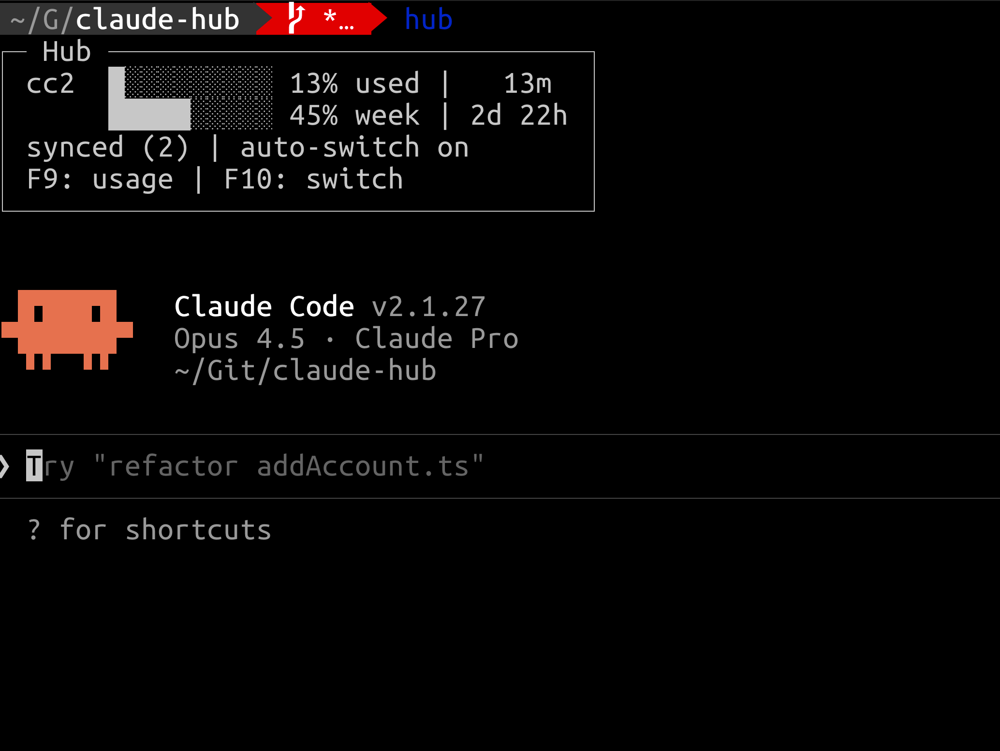
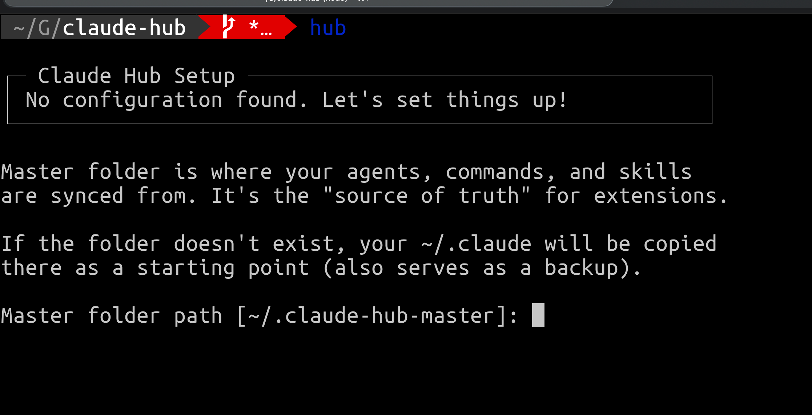

# Claude Hub

A CLI tool for managing multiple Claude Code accounts. Keeps conversations, agents, commands, and skills in sync across accounts, with real-time usage tracking to help you spread usage evenly by always starting sessions on the account with the most remaining quota. No need to logout/login to work with multiple accounts. Syncs your conversations across your accounts and sync your skills, commands, and agents through a "master" folder so you simply add a new skill/command/agent in your master folder and they will be synced to all accounts.

> **Supported platforms:** MacOS and Windows

### Launch Claude (Auto-Select Best Account)

```bash
hub
```



This will:
1. Check usage across all accounts
2. Auto-select the account with most remaining quota
3. Sync conversations, skills, commands, and agents, sk (if `syncOnStart` is true)
4. Launch Claude with the selected account

Example output (compact):
```
┌─ Hub ───────────────────────────────┐
│ account2  ██░░░░░░░░  22% used | ⏱ 3h 51m │
│           ███░░░░░░░  30% week | ⏱ 3d 18h │
│ ✓ synced                                  │
└───────────────────────────────────────────┘
```

Use `-v` for verbose output:
```bash
hub -v
# Shows detailed sync info and traditional launch messages
```

### Use a Specific Account

```bash
hub --account account2
```

## Why?

If you have multiple Claude Pro subscriptions, you've probably experienced this:

```
c1           # Launch first account
/usage       # Check usage... 80% used
c2           # Try second account
/usage       # 95% used, ugh
c3           # Third account?
/usage       # Session limit reached!
# Back to c1...
```

Claude Hub solves this by:
- **Auto-selecting** the best account based on remaining quota when you start a session
- **Manual switching** mid-session with F10 if you hit a rate limit
- **Syncing conversations** so you can resume from any account
- **Syncing extensions** (agents/commands/skills) from a master folder
- Showing **real usage** for all accounts in one command

> **Note:** "Smart selection" happens at session start—Hub picks the account with the most remaining quota. It does **not** automatically switch accounts mid-session. If you hit a rate limit, use **F10** to manually switch to another account.

## Installation

```bash
# Clone the repo
git clone git@github.com:clauderoy790/claude-hub.git
cd claude-hub

# Install dependencies
npm install

# Build and make 'hub' command available globally
npm run install-cli

# To uninstall
npm run uninstall-cli
```

> **Note:** On macOS, you may need `sudo npm run install-cli`. On Windows, run as Administrator if you get permission errors.

### Windows Prerequisites

Windows requires Visual Studio Build Tools for native module compilation:

1. Install [Visual Studio Build Tools 2019](https://visualstudio.microsoft.com/downloads/#build-tools-for-visual-studio-2019) (or full Visual Studio)
2. During installation, select **"Desktop development with C++"** workload
3. In **Individual components**, also select:
   - MSVC v142 - VS 2019 C++ x64/x86 Spectre-mitigated libs (Latest)

> **Troubleshooting:** If `npm install` fails with node-gyp errors:
> 1. Ensure Spectre-mitigated libraries are installed (VS Installer → Individual components → search "spectre" → install Latest)
> 2. Update npm: `npm install -g npm@latest`

## Getting Started

### First Run

When you run `hub` for the first time, it will guide you through setup:

> **Note:** The first launch may take a bit longer if your OAuth tokens have expired, as Hub needs to refresh them for each account. The more accounts you have, the longer this takes—but it's typically just a few extra seconds per account.



```
$ hub

┌─ Claude Hub Setup ─────────────────────────────────────┐
│ No configuration found. Let's set things up!           │
└────────────────────────────────────────────────────────┘

Master folder path [~/.claude-hub-master]:
✓ Created ~/.claude-hub-master (copied from ~/.claude)
  This also serves as a backup of your original config.

Found existing Claude configs:
  ~/.claude → add as "main"? (Y/n) y

Configuration saved to config.json
```

The setup:
- Creates a **master folder** (copies your `~/.claude` as a starting point/backup)
- Detects existing Claude config directories
- Generates `config.json`

### Adding More Accounts

To add another Claude Pro account:

```bash
hub --add-account work
```

This will:
1. Create a new config directory (`~/.claude-work`)
2. Launch Claude for you to authenticate
3. Add the account to `config.json`

**Authentication flow:**
- When Claude launches, it will prompt you to log in
- Log in with your **other** Anthropic account (the one you want for "work")
- After authenticating, exit Claude (Ctrl+C or `/exit`)
- The account is now configured

### Renaming an Account

To rename an existing account (e.g., from "main" to "cc1"):

```bash
hub --rename-account main cc1
```

This updates `config.json` without modifying the underlying config directory.

### Manual Configuration

You can also edit `config.json` directly:

```json
{
  "accounts": {
    "main": "~/.claude",
    "work": "~/.claude-work"
  },
  "masterFolder": "~/.claude-hub-master",
  "syncOnStart": true
}
```

| Field | Description |
|-------|-------------|
| `accounts` | Map of account names to config directories |
| `masterFolder` | Source of truth for agents/commands/skills |
| `syncOnStart` | Auto-sync before launching Claude |

### Setting Up Multiple Accounts Manually

If you prefer to set up accounts without `--add-account`:

1. **Create a config directory:**
   ```bash
   mkdir ~/.claude-work
   ```

2. **Launch Claude with that directory:**
   ```bash
   CLAUDE_CONFIG_DIR=~/.claude-work claude
   ```

3. **Authenticate** with your other Anthropic account

4. **Add to config.json:**
   ```json
   {
     "accounts": {
       "main": "~/.claude",
       "work": "~/.claude-work"
     }
   }
   ```

## Usage

### Check Usage Across All Accounts

```bash
hub --usage
```

Output:
```
Claude Hub Usage

main (user@example.com)
  Session  ██████████   99% | ⏱ 48m
  Weekly   █░░░░░░░░░   11% | ⏱ 6d 19h

account2 (user2@example.com)  ← best
  Session  ██░░░░░░░░   21% | ⏱ 48m
  Weekly   ███░░░░░░░   30% | ⏱ 3d 20h
```

The display shows:
- **Progress bar**: Visual indicator of usage (█ = used, ░ = available)
- **Percentage**: How much of your quota is used
- **Reset timer** (⏱): When the quota resets (hours/minutes for session, days/hours for weekly)
- **Best indicator**: The account with most remaining quota is marked `← best`

### Sync Only (Don't Launch Claude)

```bash
hub --sync

# With verbose output
hub --sync -v
```

### Pass Arguments to Claude

Any arguments not recognized by hub are passed through to Claude:

```bash
# Resume a conversation
hub --resume abc123

# Use specific account and resume
hub --account account2 --resume xyz

# Continue last conversation
hub -c
```

## CLI Reference

```
hub                              Auto-select best account, sync, and run claude
hub --account <name>             Use specific account (skip auto-selection)
hub --add-account <name>         Add a new Claude account
hub --rename-account <old> <new> Rename an existing account
hub --sync                       Sync only, don't run claude
hub --usage                      Show combined usage across all accounts
hub --no-auto-switch             Disable automatic account switching on rate limit
hub login                        Show login status (days left) for all accounts
hub login <account>              Sign an account in, in its own Chrome profile
hub mcp add <name> [args]        Add MCP server (synced to all accounts)
hub mcp remove <name>            Remove MCP server from all accounts
hub mcp list                     List MCP servers
hub -v, --verbose                Show detailed sync output
hub -h, --help                   Show help
```

## How It Works

### Usage Tracking

Claude Hub fetches **real usage data** directly from Anthropic's API using OAuth tokens. This gives you accurate percentages (not estimates).

**Token storage:**
- **macOS**: Keychain entries (e.g., `"Claude Code-credentials"` for `~/.claude`)
- **Windows**: `.credentials.json` files in each config directory

See [Multi-Account Keychain Guide](docs/multi-account-keychain.md) for macOS details.

Hub only ever **reads** these credentials. Refresh tokens are single-use and rotate,
so refreshing one outside the Claude CLI can leave the CLI holding a dead token and
log the account out for good — refreshing is left entirely to `claude`.

### Logins

A claude.ai login lasts about **30 days from `/login`**, and using the account does
not extend that window — signing in again is the only thing that resets the clock.

```bash
hub login             # who's signed in, and for how much longer
hub login cc2         # sign cc2 in, or renew it early
```

```
Claude Hub Logins

  ✓ cc1   me@gmail.com    11 days left    Chrome: cc1
  ✗ cc2   me2@gmail.com   logged out      Chrome: cc2
```

Hub makes the monthly renewal as painless as it can be:

- **Warns early** — the startup box and F9 flag a login expiring within 5 days.
- **Offers to renew at launch** — one keystroke while you're starting work, instead of
  an interruption mid-task. Asked at most once a day per account.
- **Signs in automatically** — starting an account whose login has already lapsed drops
  you straight into the browser flow, then into your session. No error, no second command.
- **One browser profile per account** — account `cc2` logs in through Chrome profile
  `cc2`, created on first use. Because Claude Code opens the browser via `$BROWSER`, hub
  points it at that profile for both `hub login` *and* any `/login` typed mid-session —
  so you never have to sign claude.ai out of one account to sign into another.
- **Cleans up after itself** — the "Sign in" and "Sign in successful" tabs are closed
  once the token is stored, and Chrome quits if that leaves nothing open. If you use
  Chrome normally your windows are untouched and it keeps running; only OAuth-flow URLs
  are ever matched, never a Claude tab you're working in. macOS only, and it needs
  permission to control Chrome, which macOS asks for the first time.

The first login for an account opens a brand-new Chrome profile; sign into claude.ai
there once as that account and it stays signed in from then on. To reuse a profile you
already have instead, add `"chromeProfiles": { "cc2": "Profile 2" }` to `config.json`.

**Tip:** sign each Chrome profile into Google with that account's address. claude.ai
then offers *Continue with Google* and the whole renewal is one click — no emailed
code or link. If you do get an emailed sign-in link, open it **in that same Chrome
window**; the pending login lives in that profile's cookies, so clicking it from your
usual browser signs the wrong profile in and leaves the original stuck.

### Conversation Sync

Conversations are stored as `.jsonl` files in each account's `projects/` directory. Hub syncs these across all accounts so you can:
- Start a conversation on one account
- Continue it on another when the first hits rate limits

### Extension Sync

Extensions (agents, commands, skills) are synced from your `masterFolder` to all accounts:

```
masterFolder/
├── agents/
│   └── my-agent.md
├── commands/
│   └── my-command.md
└── skills/
    └── my-skill/
        └── SKILL.md
```

- New extensions added to any account are copied to master
- Deletions from master are propagated to all accounts
- Master folder is the source of truth

### MCP Server Sync

MCP (Model Context Protocol) servers are synced across all accounts. Instead of running `claude mcp add` for each account, use `hub mcp add` once and it syncs everywhere.

**Add an MCP server to all accounts:**
```bash
hub mcp add codex-cli -- npx -y codex-mcp-server
```

**List configured MCP servers:**
```bash
hub mcp list
```

**Remove an MCP server from all accounts:**
```bash
hub mcp remove codex-cli
```

**All `claude mcp add` flags are supported:**
```bash
# With environment variables
hub mcp add -e API_KEY=xxx my-server -- npx my-mcp-server

# HTTP transport
hub mcp add --transport http sentry https://mcp.sentry.dev/mcp

# With headers
hub mcp add --transport http -H "Authorization: Bearer xxx" my-api https://api.example.com/mcp
```

MCP servers are stored in the master folder's `.claude.json` and synced to all accounts on every `hub` run or `hub mcp add/remove`. Only the `mcpServers` key is synced — all account-specific data (credentials, usage stats, etc.) is preserved.

### History Sync

The `history.jsonl` file (conversation index) is merged across accounts, deduplicated by `sessionId + timestamp`.

## Project Structure

```
claude-hub/
├── src/
│   ├── index.ts           # CLI entry point
│   ├── config.ts          # Configuration management
│   ├── auth/
│   │   ├── status.ts          # Login expiry state per account
│   │   ├── login.ts           # hub login subcommand
│   │   └── browser.ts         # Per-account Chrome profile routing
│   ├── sync/
│   │   ├── conversations.ts   # Conversation sync
│   │   ├── extensions.ts      # Agents/commands/skills sync
│   │   ├── history.ts         # History merge
│   │   └── mcp.ts             # MCP server sync
│   ├── usage/
│   │   ├── api.ts             # Anthropic API usage fetching
│   │   ├── apiDisplay.ts      # Progress bar display with reset timers
│   │   ├── selector.ts        # Smart account selection logic
│   │   └── parser.ts          # Legacy ccusage parser (estimates)
│   ├── mcp/
│   │   └── commands.ts        # hub mcp add/remove/list subcommands
│   ├── pty/
│   │   └── wrapper.ts         # PTY wrapper with F9/F10 key detection
│   └── utils/
│       └── files.ts           # File utilities
├── docs/
│   └── multi-account-keychain.md
├── config.json            # Your configuration
├── package.json
└── tsconfig.json
```

## Documentation

- [Multi-Account Keychain Guide](docs/multi-account-keychain.md) - How Claude stores tokens for multiple accounts
- [Technical Notes](docs/technical-notes.md) - Implementation details, API info, and troubleshooting

## Development

```bash
# Build
npm run build

# Run all tests
npm test

# Run unit tests only (fast, mocked, runs anywhere)
npm run test:unit

# Run integration tests only (real system calls, platform-specific)
npm run test:integration
```

Tests use [Jest](https://jestjs.io/) with TypeScript. Unit tests are in `tests/unit/`, integration tests in `tests/integration/`. When adding new features, include unit tests to prevent regressions.

## Requirements

- Node.js 18+
- macOS or Windows
- Claude Code CLI installed (`claude` command available)
- Multiple Claude Pro accounts (optional, works with one too)
- Windows: Visual Studio Build Tools 2019 with C++ workload (for native module compilation)

## Troubleshooting

### "Logged out" / "Not logged in"

Sign the account back in:

```bash
hub login account2
```

Logins last about 30 days and can't be extended by use, so this is expected
periodically — `hub login` shows how long each account has left. An account can also
be signed out early if something refreshes its token outside the Claude CLI (see
*Usage Tracking* above).

### Token Expired (401)

Nothing to do — the access token refreshes automatically the next time you start a
session with that account. `hub --usage` may briefly show `token expired` for an idle
account; that's the 8-hour access token, not the login.

Don't try to force a refresh by launching and killing `claude`. Refresh tokens are
single-use, so a refresh interrupted partway can permanently log the account out.

### Usage Shows Wrong Data

Make sure each account has been used at least once with its config directory so the keychain entry exists.

### Rate Limit Hit

If you hit a rate limit mid-session, press **F10** to manually switch to another account. Your conversation will be synced and resumed on the new account.

The rate limit is a 5-hour rolling window. The "resets at" time (shown with F9 or `hub --usage`) tells you when your quota starts refreshing.

### Shift+Enter Not Working (Windows)

If Shift+Enter submits instead of creating a new line, use **Ctrl+J** or type `\` then Enter as alternatives that work without configuration.

To fix Shift+Enter in Windows Terminal, open settings (`Ctrl+,` → "Open JSON file") and add:

**In the `"actions"` array:**
```json
{
    "command":
    {
        "action": "sendInput",
        "input": ""
    },
    "id": "User.shiftEnter"
}
```

**In the `"keybindings"` array:**
```json
{
    "id": "User.shiftEnter",
    "keys": "shift+enter"
}
```

Restart Windows Terminal for changes to take effect.

## Keyboard Shortcuts

While Claude is running via `hub`, use these keyboard shortcuts:

| Key | Action |
|-----|--------|
| **F9** | Show usage for all accounts |
| **F10** | Switch to another account |

### F9 - Show Usage

Press **F9** to open a full-screen usage display:

```
Hub Usage

main (user@example.com)  <- current
  Session  ████████████░░░░░░░░  30%  resets in 2h 55m
  Weekly   ███░░░░░░░░░░░░░░░░░  15%  resets in 6d 16h

account2 (user2@example.com)  (best)
  Session  ██████████████░░░░░░  67%  resets in 2h 55m
  Weekly   ████████░░░░░░░░░░░░  38%  resets in 3d 17h

Press any key to return
```

Press any key to return to Claude.

### F10 - Switch Account

Press **F10** to open the account switching menu:

```
Switch Account

main (user@example.com)  <- current
  Session  ████████████░░░░░░░░  30%  resets in 2h 55m
  Weekly   ███░░░░░░░░░░░░░░░░░  15%  resets in 6d 16h

account2 (user2@example.com)  (best)
  Session  ██████████████░░░░░░  67%  resets in 2h 55m
  Weekly   ████████░░░░░░░░░░░░  38%  resets in 3d 17h

[1] account2 (recommended)
[Esc] Cancel

Press 1 to switch, Esc to cancel
```

- Press a number key (1, 2, etc.) to switch to that account
- Your session is automatically synced and resumed on the new account
- Press Esc to cancel and return to Claude

## Development Plans

| Plan | Description | Created | Status |
|------|-------------|---------|--------|
| [Plan 1](plans/1_claude-hub-implementation.md) | Core functionality | 2026-01-18 | Completed |
| [Plan 2](plans/2_ux-improvements.md) | UX improvements & in-session commands | 2026-01-30 | Completed |
| [Plan 4](plans/4_mcp-sync.md) | MCP server sync across accounts | 2026-02-08 | Completed |
| [Plan 5](plans/5_login-lifecycle.md) | Login expiry, auto re-login, browser profiles | 2026-08-01 | Completed |
| [Plan 6](plans/6_login-lifecycle-windows.md) | Login lifecycle on Windows | 2026-08-03 | Investigation |

## License

MIT
